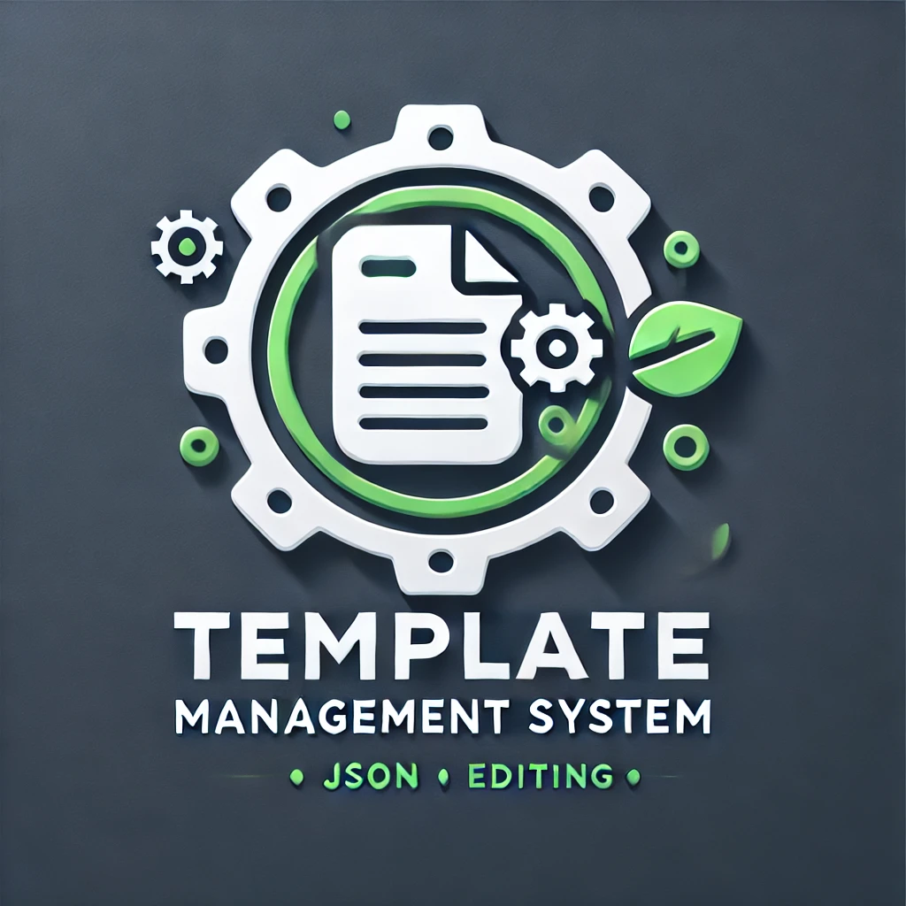

# AI Template Editor



## 🚀 Overview

**AI Template Editor** is a full-stack application designed to create, manage, and publish templates with advanced features like version control, AI-powered suggestions, and dynamic JSON editing.

## 🔧 Technologies Used

- **Backend**: FastAPI (Python)
- **Frontend**: React.js
- **Database**: SQL
- **AI Integration**: OpenAI API

## ✨ Key Features

✅ **Version Control** - Track and manage template changes efficiently.
✅ **AI-Powered Suggestions** - Leverage OpenAI API for smart auto-completions and recommendations.
✅ **Dynamic JSON Editor** - User-friendly JSON editor with schema validation and auto-formatting.
✅ **Secure & Scalable** - JWT-based authentication, role-based access control, and structured SQL database.

## 🛠️ How It Works

1. **Build REST APIs** - FastAPI handles template and version management.
2. **Dynamic UI** - React-based interface for seamless user experience.
3. **AI-Powered Enhancements** - AI-driven autocomplete and smart suggestions.
4. **Robust JSON Editor** - Enables easy configuration and validation.
5. **Security & Scalability** - JWT authentication and structured SQL database.

## 📂 Installation

```bash
# Clone the repository
git clone https://github.com/yourusername/ai-template-editor.git
cd ai-template-editor

# Install backend dependencies
pip install -r backend/requirements.txt

# Install frontend dependencies
cd frontend
npm install

# Run the backend
cd ../backend
uvicorn main:app --reload

# Run the frontend
cd ../frontend
npm start
```
